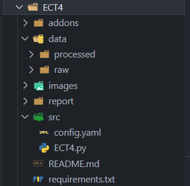

# Project Initialization Script

<div align="center">
  
  <h4>Figure 1: Default Folder Structure</h4>
</div>

## Introduction

This project presents a Python-based solution designed to automate the initialization of a standardized project directory structure. By executing a single script, users can generate a comprehensive folder hierarchy along with essential starter files, facilitating a consistent and efficient workflow for data analysis, software development, or research projects.

## Features

- **Automated Directory Creation**: Generates a predefined folder structure, including:

  - `src/`: Contains source code files.
    - `config.yaml`: Configuration file with predefined paths.
    - `<project_name>.py`: Main Python script with essential imports and initial setup.
  - `data/`:
    - `raw/`: Directory for raw data.
    - `processed/`: Directory for processed data.
  - `images/`: Folder for storing images and figures.
  - `report/`: Directory for reports and documentation.
  - `addons/`: Folder for additional scripts or utilities.
  - `requirements.txt`: File listing required Python packages.

- **Configuration Management**: Initializes a `config.yaml` file with relative paths to key directories, allowing for flexible path handling within the project.

- **Starter Code Generation**: Creates a main Python script that:

  - Imports essential libraries (`pandas`, `matplotlib`, `datetime`, `os`, `yaml`).
  - Loads configuration settings.
  - Initializes directory paths based on the configuration.
  - Prints the project initialization date and time.

- **Requirements Specification**: Provides a `requirements.txt` file to facilitate the setup of the Python environment with all necessary dependencies.

- **README Template**: Generates a `README.md` file with a structured outline, including sections for Introduction, How to Use, and Conclusion, guiding users on how to document their project effectively.

## How to Use

1. **Clone the Repository**: Download or clone the project to your local machine.

2. **Run the Initialization Script**:

   ```bash
   python project_creator.py
   ```

   - **Input Prompts**:
     - **Base Path**: Enter the directory where you want the project to be created.
     - **Project Name**: Enter the desired name for your project.

3. **Customize Your Project**:

   - Edit the `config.yaml` file in the `src/` directory to adjust configuration settings as needed.
   - Add your code to the `<project_name>.py` script in the `src/` directory.
   - Update the `README.md` with detailed information about your project.

## Conclusion

This project serves as a foundational tool to streamline the setup of new projects by automating the creation of a standardized directory structure and initializing essential files. It enhances productivity by reducing setup time and ensures consistency across different projects, which is particularly beneficial in collaborative or academic environments.

